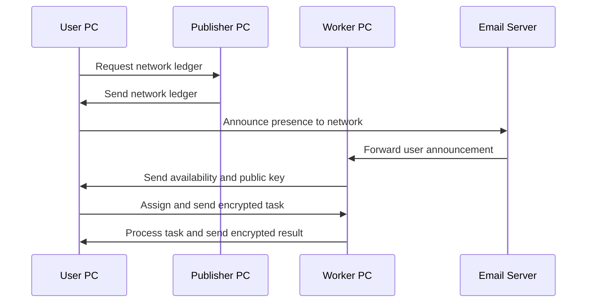

# NADOO Connect

## GPT

<https://chat.openai.com/g/g-YbUmf9xif-nadoo-connect-senior-dev>

## About the Project

NADOO Connect is an innovative solution that enables customers to send automated messages to our company using email-based communication. This project serves as a bridge between customer PCs and our company's system, focusing on simplicity, security, and efficiency.

## How It Works

NADOO Connect uses email as the primary communication channel to securely and efficiently transfer data and commands. Customer PCs send encrypted messages, which are received and processed by our system.

### Workflow Diagram


## Installation and Usage

(Detailed instructions for installation and usage of the software)

### Using `create_execution`

To use `create_execution` in NADOO Connect:

```python
create_execution(customer_program_uuid)
```

This function is used to signal our backend that a user has used one of our programs, initiating a process for billing at the end of the month.

### Using `get_xyz_for_xyz_remote`

To use `get_xyz_for_xyz_remote` for remote procedure calls:

```python
result = await get_xyz_for_xyz_remote(uuid, data)
```

This function sends a request to the backend with the specified UUID, which identifies the function to execute, and data for that function. The function processes the request and returns the result.

## License

This project is licensed under the MIT License. For more details, see the LICENSE file.

## Contributors

(List of contributors and their roles in the project)

For more information and support, please contact <support@nadooit.de>.

## Update 0.1.1

### What's New in 0.1.1

Improved asyncio event loop management in sender_loop...
Enhanced concurrency control using portalocker...
Added detailed debug print statements...

### Fixes

Addressed an issue where the sender loop was not terminating...
Resolved potential concurrency issues...

### Known Issues

There are no known issues as of this update.

## Update 0.2.0 - Feature Update

### What's New in 0.2.0

Ledger System Implementation: Introduced a ledger system...
Dynamic Synchronization of Work and User PCs: Implemented a publish-subscribe model...
Enhanced Encryption Mechanisms: Enhanced the security...
Efficient Task Assignment and Processing: Streamlined the process...
Automated Ledger Updates and Synchronization: Automated the process...
Security and Authentication Enhancements: Introduced robust authentication mechanisms...

### Fixes

Various performance optimizations and bug fixes...

### Known Issues

There are no known issues as of this update.

### Network Handshaking and Worker Management Diagram


