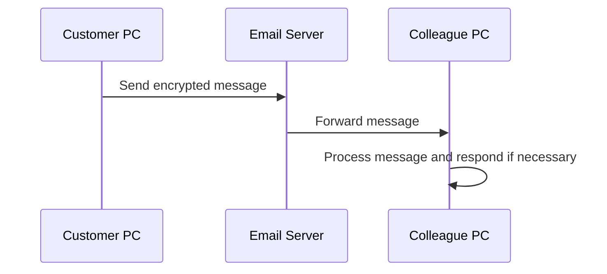

# NADOO Connect

## GPT

<https://chat.openai.com/g/g-YbUmf9xif-nadoo-connect-senior-dev>

## About the Project

NADOO Connect is an innovative solution that enables customers to send automated messages to our company using email-based communication. This project serves as a bridge between customer PCs and our company's system, focusing on simplicity, security, and efficiency.

## How It Works

NADOO Connect uses email as the primary communication channel to securely and efficiently transfer data and commands. Customer PCs send encrypted messages, which are received and processed by our system.

### Workflow Diagram



## Installation and Usage

(Detailed instructions for installation and usage of the software)

## License

This project is licensed under the MIT License. For more details, see the LICENSE file.

## Contributors

(List of contributors and their roles in the project)

For more information and support, please contact <support@nadooit.de>.

## Update 0.1.1

### What's New in 0.1.1

- Improved asyncio event loop management in `sender_loop` to enhance performance and prevent unnecessary restarts.
- Enhanced concurrency control using `portalocker` for managing the sender loop.
- Added detailed debug print statements in the sender loop for better monitoring and troubleshooting.

### Fixes

- Addressed an issue where the sender loop was not terminating correctly after being idle.
- Resolved potential concurrency issues with multiple executions and sender loop restarts.

### Known Issues

- There are no known issues as of this update.

## Update 0.2.0 - Feature Update

### What's New in 0.2.0

- **Ledger System Implementation**: Introduced a ledger system across the network.
  Each PC now maintains a record (ledger) of all active participants in the network,
  enhancing the system's dynamic response and communication security.
  
- **Dynamic Synchronization of Work and User PCs**: Implemented a publish-subscribe model
  for dynamic and decentralized communication. This system allows work PCs to announce their
  availability and public keys to user PCs, and user PCs to update their active worker list
  based on these announcements.

- **Enhanced Encryption Mechanisms**: Enhanced the security of the communication with improved
  encryption practices. This includes secure exchange and usage of public-private key pairs for
  each communication, ensuring that data transferred is encrypted and can only be decrypted by
  the intended recipient.

- **Efficient Task Assignment and Processing**: Streamlined the process of task assignment and
  processing, ensuring that tasks are encrypted and sent to the most appropriate and available
  worker PC. Includes mechanisms for handling worker PC downtime and task reassignment.

- **Automated Ledger Updates and Synchronization**: Automated the process of ledger updates,
  ensuring that each participant in the network has the latest information about active users
  and worker PCs.

- **Security and Authentication Enhancements**: Introduced robust authentication mechanisms
  for adding new PCs to the network and validating the authenticity of communication between PCs.

### Fixes

- Various performance optimizations and bug fixes to improve the overall efficiency
  and reliability of the system.

### Known Issues

- There are no known issues as of this update.

### Network Handshaking and Worker Management Diagram

```mermaid
sequenceDiagram
    participant UserPC as User PC
    participant PublisherPC as Publisher PC
    participant WorkerPC as Worker PC
    participant EmailServer as Email Server

    UserPC->>PublisherPC: Request network ledger
    PublisherPC->>UserPC: Send network ledger
    UserPC->>EmailServer: Announce presence to network
    EmailServer->>WorkerPC: Forward user announcement
    WorkerPC->>UserPC: Send availability and public key
    UserPC->>WorkerPC: Assign and send encrypted task
    WorkerPC->>UserPC: Process task and send encrypted result
