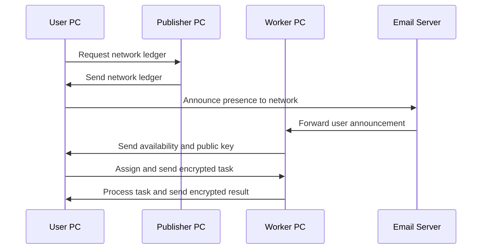
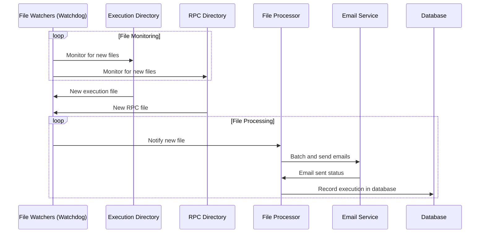
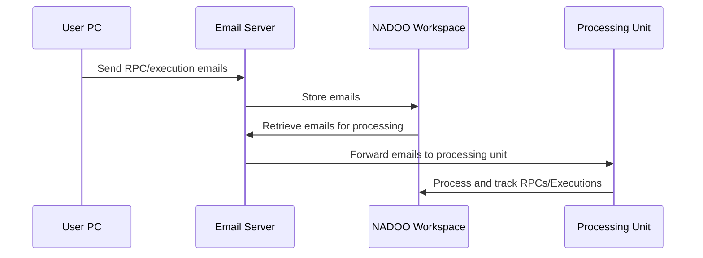

# NADOO Connect

## GPT

<https://chat.openai.com/g/g-YbUmf9xif-nadoo-connect-senior-dev>

## About the Project

NADOO Connect is an innovative solution that enables customers to send automated messages to our company using email-based communication. This project serves as a bridge between customer PCs and our company's system, focusing on simplicity, security, and efficiency.

## How It Works

NADOO Connect uses email as the primary communication channel to securely and efficiently transfer data and commands. Customer PCs send encrypted messages, which are received and processed by our system.

### Workflow Diagram


## Installation and Usage

(Detailed instructions for installation and usage of the software)

### Using `create_execution`

To use `create_execution` in NADOO Connect:

```python
create_execution(customer_program_uuid)
```

This function is used to signal our backend that a user has used one of our programs, initiating a process for billing at the end of the month.

### Using `get_xyz_for_xyz_remote`

To use `get_xyz_for_xyz_remote` for remote procedure calls:

```python
result = await get_xyz_for_xyz_remote(uuid, data)
```

This function sends a request to the backend with the specified UUID, which identifies the function to execute, and data for that function. The function processes the request and returns the result.

## License

This project is licensed under the MIT License. For more details, see the LICENSE file.

## Contributors

(List of contributors and their roles in the project)

For more information and support, please contact <support@nadooit.de>.

## Update 0.1.1

### What's New in 0.1.1

Improved asyncio event loop management in sender_loop...
Enhanced concurrency control using portalocker...
Added detailed debug print statements...

### Fixes

Addressed an issue where the sender loop was not terminating...
Resolved potential concurrency issues...

### Known Issues

There are no known issues as of this update.

## Update 0.2.0 - Feature Update

### What's New in 0.2.0

Ledger System Implementation: Introduced a ledger system...
Dynamic Synchronization of Work and User PCs: Implemented a publish-subscribe model...
Enhanced Encryption Mechanisms: Enhanced the security...
Efficient Task Assignment and Processing: Streamlined the process...
Automated Ledger Updates and Synchronization: Automated the process...
Security and Authentication Enhancements: Introduced robust authentication mechanisms...

### Fixes

Various performance optimizations and bug fixes...

### Known Issues

There are no known issues as of this update.

### Network Handshaking and Worker Management Diagram



## Update 0.3.0 - Watchdog Integration


### What's New in 0.3.0

- **Integrated Watchdog Library**: Implemented the Watchdog library to efficiently monitor changes in specified directories.
- **Real-Time File Monitoring**: Enabled real-time monitoring of RPC and execution files for quicker and more efficient processing.
- **Enhanced Email Handling**: Improved the mechanism for batch processing and sending emails, ensuring more reliable communication.
- **Streamlined File Processing**: Refined the file processing workflow, resulting in faster and more accurate execution.

### Fixes

- Resolved issues related to concurrent file processing.
- Fixed bugs in the asynchronous email sending mechanism.

### Known Issues

There are no known issues as of this update.

### File Processing and Watcher Mechanism Diagram



### What's New in 0.3.1

- **Email Retrieval for RPC Calls and Execution Tracking**: Enhanced NADOO Connect to include the capability of retrieving emails for remote procedure calls (RPCs) and execution tracking. This feature is particularly useful for NADOO Workspace, the processing side of our company, to handle RPCs and monitor execution status efficiently.
- **Automated Email Fetching**: Implemented functionality to automatically fetch emails from specified email accounts, facilitating seamless communication and data transfer.
- **Secured and Restricted Access**: Ensured that user PCs do not have the login credentials to retrieve execution-related emails, maintaining data security and integrity.
- **Asynchronous Email Retrieval Function**: Introduced `get_emails_for_email_address`, a new function to asynchronously retrieve emails. When the `email_account` parameter is not specified, the function defaults to retrieving emails from the user's account, streamlining the email fetching process.

### Usage

To use `get_emails_for_email_address` in NADOO Connect:

```python
emails = await get_emails_for_email_address(email_account='optional_specific_email_account')
```

This function asynchronously retrieves emails from the specified email account. If the email_account parameter is not provided, it defaults to the user's email account set in the configuration.

### Workflow Integration

This update integrates closely with the NADOO Workspace, allowing it to process the RPCs and track executions for billing and operational purposes.

### Fixes

Minor bug fixes and performance improvements in the email retrieval process.

### Known Issues

There are no known issues as of this update.

### What's New in 0.3.1

- **Email Retrieval for RPC Calls and Execution Tracking**: Enhanced NADOO Connect to include the capability of retrieving emails for remote procedure calls (RPCs) and execution tracking. This feature is particularly useful for NADOO Workspace, the processing side of our company, to handle RPCs and monitor execution status efficiently.
- **Automated Email Fetching**: Implemented functionality to automatically fetch emails from specified email accounts, facilitating seamless communication and data transfer.
- **Secured and Restricted Access**: Ensured that user PCs do not have the login credentials to retrieve execution-related emails, maintaining data security and integrity.
- **Asynchronous Email Retrieval Function**: Introduced `get_emails_for_email_address`, a new function to asynchronously retrieve emails. When the `email_adress` parameter is not specified, the function defaults to retrieving emails from the user's address, streamlining the email fetching process.

### Usage

To use `get_emails_for_email_address` in NADOO Connect:

```python
emails = await get_emails_for_email_address(email_adress='optional_specific_email_address e.G. christoph.backhaus@nadooit.de')
```

This function asynchronously retrieves emails from the specified email address. If the email_adress parameter is not provided, it defaults to the user's email address set in the configuration.

### Workflow Integration 0.3.1

This update integrates closely with the NADOO Workspace, allowing it to process the RPCs and track executions for billing and operational purposes.

### Fixes 0.3.1

Minor bug fixes and performance improvements in the email retrieval process.


